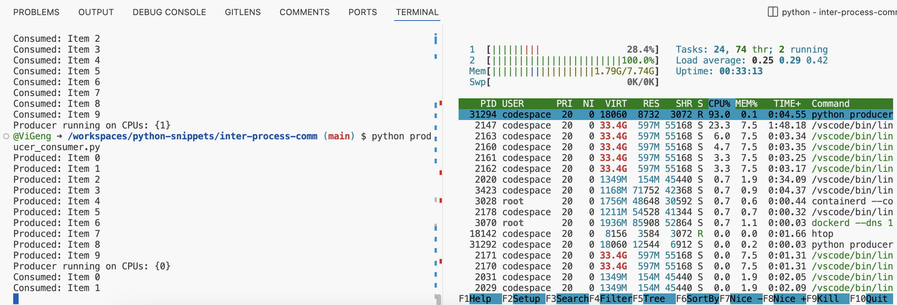
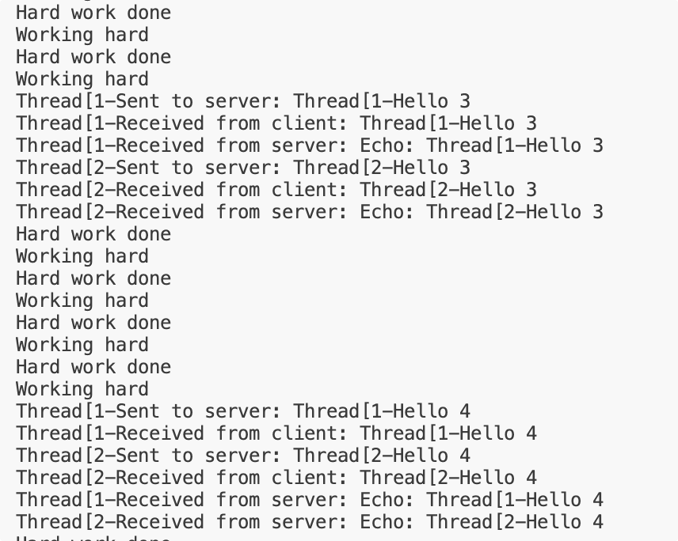
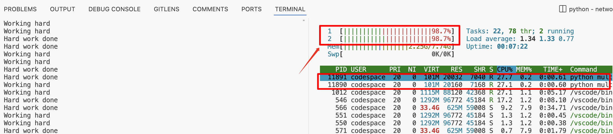

# Python Programming Snippets

- [x] [Inter-process communication](inter-process-comm/producer_consumer.py)
  * Producer-consumer problem
  * using `multiprocessing` queue
  * on different processes on the same machine on different CPUs
  * 
- [x] [multi thread and routines](./concurrency/routines.py)
  * using `threading` and event loop
  * server-client communication
  * 
- [x] multi-process: server and client
  * using `multiprocessing` and `websockets`
  * server-client communication
  * 
## TODO
- [ ] Network
  - [ ] webrtc
  - [ ] websockets
  
- [ ] enhance `multi thread and routines` to Proc-Thread-routines